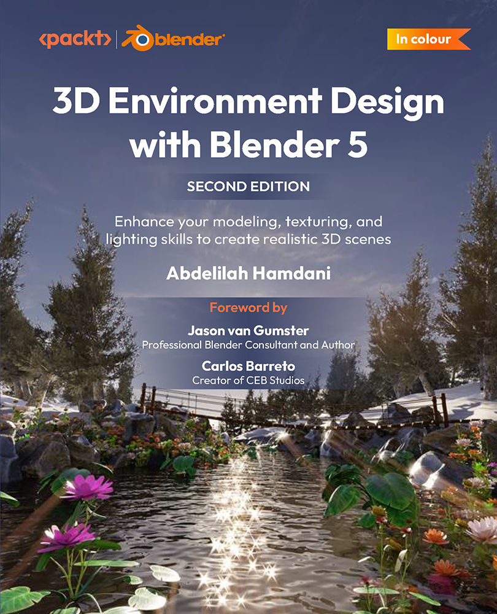

<h1 align="center">
3D Environment Design with Blender 5, Second Edition</h1>

This is the code repository for <a href ="https://www.packtpub.com/en-us/product/3d-environment-design-with-blender-5-second-edition/9781836203292"> 3D Environment Design with Blender 5, Second Edition</a>, published by Packt.

<h2 align="center">
Enhance your modeling, texturing, and lighting skills to create realistic 3D scenes
</h2>

Abdelilah Hamdani

  
 &#8287;&#8287;&#8287;&#8287;&#8287;
  
  &#8287;&#8287;&#8287;&#8287;&#8287;
   
  &#8287;&#8287;&#8287;&#8287;&#8287;

 
  
<h2>About the book

Creating photorealistic 3D scenes in Blender can be tricky sometimes due to modeling inaccuracies, scale issues, flat materials, and lighting that fails to match real-world references. These problems can make scenes look artificial and inconsistent.
Based on Blender 5, this updated second edition simplifies the complexities by guiding you through clear, practical workflows to overcome those challenges. You’ll start by addressing common modeling and proportion mistakes, then move on to realistic texturing and unwrapping to create stunning scenes based on actual references.
As you progress, you’ll create natural assets such as plants, rocks, water, flowers, and terrain, learning how to assemble them into believable environments. The book introduces modern Blender workflows, including a dedicated chapter on node-based methods for creating and scattering plants. You will then focus on lighting and rendering, using Cycles, HDRIs, and accurate color management to achieve realistic results, before finalizing your scenes with rendering and compositing.
By the end, you’ll be equipped to create beautiful, photorealistic renders that stand out.
*Email sign-up and proof of purchase required

 
  
<h2>Key Learnings

<ul>

<li>Work from 2D images to create realistic 3D models in Blender 5</li>

<li>Identify and fix common modeling and scale issues</li>

<li>Create realistic materials with effective texturing and UV unwrapping</li>

<li>Apply node-based techniques to create and distribute plants in scenes</li>

<li>Create and animate realistic water and procedural materials</li>

<li>Design photorealistic landscapes using Blender's environment tools</li>

<li>Light scenes realistically using Cycles, HDRIs, and color management</li>

<li>Finalize environments with rendering and compositing workflows</li>

</ul>

  

 
  
<h2>Chapters

     
<ol>

  <li>Most Common Modeling Mistakes That Prevent You from Achieving Photorealism</li>

  <li>The Basics of Realistic Texturing in Blender</li>

  <li>Efficient Unwrapping and Texturing in Blender</li>

  <li>Creating and Scattering Realistic Natural Plants</li>

  <li>Achieving Photorealistic Lighting in Your Environment with Blender</li>

  <li>Creating Realistic Landscapes in Blender</li>

  <li>Creating and Animating Realistic, Natural-Looking Water</li>

  <li>Creating Procedural Mud Material</li>

  <li>Texturing Landscape with Mud Material</li>

  <li>Creating Natural Assets: Rock</li>

  <li>Creating Realistic Flowers in Blender</li>

  <li>Creating Trees Ready for Large Environments</li>

  <li>Using Geometry Nodes to Scatter Objects in Blender</li>

  <li>Finalizing the Landscape and River Scenes – Lighting, Rendering, and Compositing</li>

</ol>

 
  
<h2>Requirements for this book

Blender is free software. Throughout this book, we’ll be using some techniques that require
you to have a decent setup. Anything above an i5 8th gen, 16 GB RAM, and GTX 1060 will do the
job.
<table border="1" cellspacing="0" cellpadding="8">
  <thead>
    <tr>
      <th>Software/hardware covered in the book</th>
      <th>Operating system requirements</th>
    </tr>
  </thead>
  <tbody>
    <tr>
      <td>Blender 5 or above</td>
      <td>Windows, macOS, or Linux</td>
    </tr>
    <tr>
      <td>fSpy</td>
      <td>Windows</td>
    </tr>
  </tbody>
</table>
  

    

 
  
<h2>Get to know Authors</h2>

_Abdelilah Hamdani_ Abdelilah Hamdani is a photorealistic environment designer and 3D animator who is experienced in producing 3D art in a professional environment. Projects he has worked on include the 2020 Kuwait election and the US Gambian bridge construction. Abdelilah is also an online instructor who has taught more than 25,000 students worldwide. He is the founder of Reality Fakers, a platform that teaches 3D photorealism.

 
  
<h2>Other Related Books</h2>

<ul>

  <li><a href="https://www.packtpub.com/en-us/product/procedural-3d-modeling-using-geometry-nodes-in-blender-second-edition/9781836203018">Procedural 3D Modeling Using Geometry Nodes in Blender, Second Edition</a></li>

  <li><a href="https://www.packtpub.com/en-us/product/blender-for-beginners-part-1-third-edition/9781837631094">Blender for Beginners Part 1, Third Edition</a></li>
 
</ul>

